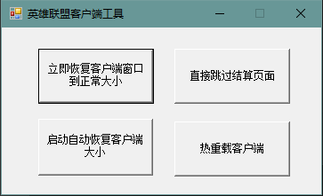

# Fix-League-Client-Update-Window
英雄联盟客户端疑难杂症解决方案。[视频演示](https://www.bilibili.com/video/BV1Cw41147iS/)

## 说明
该项目是基于 [fix-lcu-window](https://github.com/LeagueTavern/fix-lcu-window) 开发的GUI版本

## 📝功能
- [x] 修复客户端窗口大小异常 (可自动检测)
- [x] 跳过正在转圈的结算页面
- [x] 热重载客户端 (不会触发排队)

## 👋注意
- **本工具从实现原理上没有封号的可能**。
- 本工具依赖 `.NET Framework 4.8` (`Windows 10` 以上一般自带)

## 🚀如何使用
1. 从 [这里](https://github.com/KISS-GG/Fix-LCU-Window-GUI/releases/) 下载最新版本。
2. 解压到任意目录下，桌面也好，总之你方便找到就行。
3. 启动`Fix-LCU-Window-GUI.exe`，**程序可能会申请管理员权限，请务必点 [是] ，否则程序将无法运行**。
4. 点击你想要执行的功能。

## 实现原理
1. 修复客户端窗口大小异常
    - 获取目标窗口HWND
    - 获取屏幕大小
    - 通过LCUAPI获取客户端缩放比，并根据比例对窗口尺寸进行计算
    - 设置窗口与CEF渲染区域的大小
2. 跳过正在转圈的结算页面
    - 基于LCUAPI实现
3. 热重载客户端
    - 基于LCUAPI实现

## 协议
本项目遵循[MIT](https://github.com/LeagueTavern/fix-lcu-window/blob/master/LICENSE.txt)